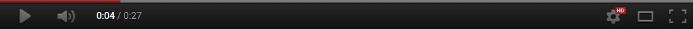
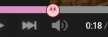

<h1 align="center">YT-HTML5-Player <kbd>2.0dev9</kbd></h1>

Try to recreate all the old YouTube player looks.

## Screenshots.

  
   
  <a href="docs/2015/photos.md">2015 Screenshots here</a>

   
   

  
   
  <a href="docs/2012/photos.md">2012 Screenshots here</a>

   
   

  
   
  <a href="docs/2010/photos.md">2012 Screenshots here</a>

## How to work.
1. [Download Tampermonkey](https://www.tampermonkey.net/)
2. Install the script [here](https://github.com/ktg5/YT-HTML5-Player/raw/dev/YT-HTML5-Player.user.js)
3. (If you have a YouTube tab open, reload it.)

## User customization!
If you wanted to edit the look of the player:
1. Open up the menu at the top right of your YouTube page.
2. Scroll down to "Import or Copy, and Reset Settings".
3. Copy the code from one of the examples or somewhere else, and paste it into the big text box in the menu.
4. Click on the "Apply settings" button, and reload the page!

Some examples:

  
  
Luigi theme v1.1 | <a href="https://github.com/ktg5/YT-HTML5-Player/blob/dev/docs/custom-scripts/luigi-player.json">View the code</a>

   
   
  
  
  
Kirby theme v1.1 | <a href="https://github.com/ktg5/YT-HTML5-Player/blob/dev/docs/custom-scripts/kirby-player.json">View the code</a>

