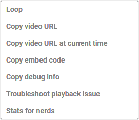
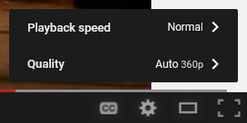
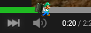

<h1 align="center">YT-HTML5-Player <kbd>2.0dev5</kbd></h1>

Try to recreate the old YouTube 2012-2015 player.

## Screenshots.

  
  
When not hovering over the progress bar.

   
  
  
  
When hovering over the progress bar.

   

  
  
Context menu.

   

  
  
Settings menu.

## How to work.
1. [Download Tampermonkey](https://www.tampermonkey.net/)
2. Install the script [here](https://github.com/ktg5/YT-HTML5-Player/raw/dev/YT-HTML5-Player.user.js)

## User customization!
If you'd like to customize the player (color, scrubber image), edit the userscipt through the Tampermonkey dropdown menu and mess around with some of the values and such!

Some examples:

  
  
Luigi theme v1.1 | <a href="https://github.com/ktg5/YT-HTML5-Player/blob/dev/docs/custom-scripts/luigi-player.js">View the code</a>

   
   
  
  
  
Kirby theme v1.1 | <a href="https://github.com/ktg5/YT-HTML5-Player/blob/dev/docs/custom-scripts/kirby-player.js">View the code</a>

