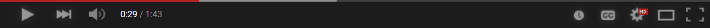

<h1 align="center">YT-HTML5-Player <kbd>2.0dev6</kbd></h1>

Try to recreate all the old YouTube player looks.

## Screenshots.

<a href="docs/2015/photos.md">2015 Screenshots here</a>

<a href="docs/2012/photos.md">2012 Screenshots here</a>

## How to work.
1. [Download Tampermonkey](https://www.tampermonkey.net/)
2. Install the script [here](https://github.com/ktg5/YT-HTML5-Player/raw/dev/YT-HTML5-Player.user.js)
3. (If you have a YouTube tab open, reload it.)

## User customization!
If you'd like to customize the player (color, scrubber image), edit the userscipt through the Tampermonkey dropdown menu and mess around with some of the values and such!

Some examples:

  
  
Luigi theme v1.1 | <a href="https://github.com/ktg5/YT-HTML5-Player/blob/dev/docs/custom-scripts/luigi-player.js">View the code</a>

   
   
  
  
  
Kirby theme v1.1 | <a href="https://github.com/ktg5/YT-HTML5-Player/blob/dev/docs/custom-scripts/kirby-player.js">View the code</a>

